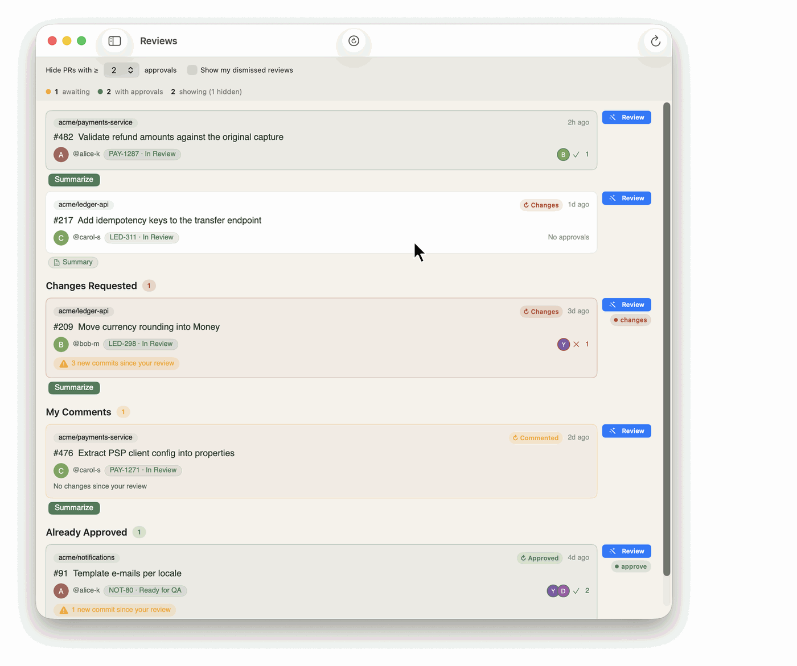
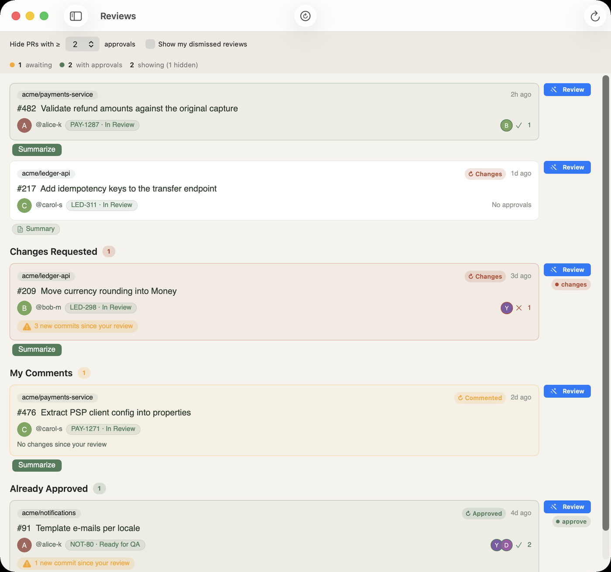
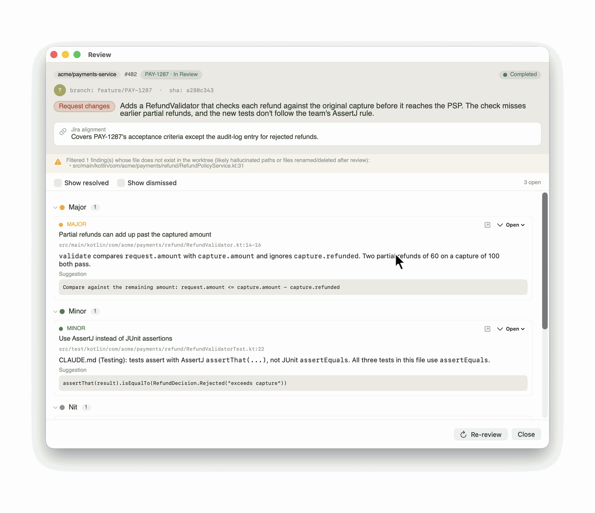

# Foreword

[](https://github.com/nakielsh/foreword-app/actions/workflows/ci.yml)

[](LICENSE)

A macOS app for the pull requests waiting on you. Foreword lists every PR you review in one place, tells you which ones moved since you last looked, and runs a [Claude Code](https://docs.anthropic.com/en/docs/claude-code) review of any of them with one click: in its own git worktree, with the linked Jira ticket as context. Click a finding and IntelliJ opens at that line.

Findings stay on your machine. Foreword never posts to GitHub; the review is for you to read before you write your own.

<p align="center">
  
</p>

<sub>All captures use demo data: the PRs, people and Jira tickets are invented and the Claude output is a canned replay. The views, the findings filter and the IntelliJ launcher are the app's own code.</sub>

## Why

GitHub's "review requested" list forgets a PR as soon as you review it. It comes back only if the author re-requests you, and authors pushing fixes often don't. Every morning started with the same three questions: which PRs need me, did I already comment, and has the diff moved since? Checking a PR out to review it clobbered my own working tree, and Jira, the diff and the IDE sat in three separate windows.

Foreword answers the three questions in one view and turns the rest into one button.

## Features

### Every PR you review, in one list

<p align="center">
  
</p>

- **Reviews**: PRs where your review is requested, then the ones you already reviewed, grouped as *Changes Requested*, *My Comments* and *Already Approved*, each flagged with "N new commits since your review". Hide PRs that already have enough approvals.
- **My PRs**: PRs you opened, with each reviewer's state, unresolved threads waiting on you, and comment counts.
- **Sessions**: Claude Code sessions running on your machine right now.
- **Jira badges** with the ticket key and status on PRs whose branch names a ticket, and a **menu-bar item** with counts.

### One-click review

**Review** checks the PR out into its own worktree, pulls in the Jira ticket, and runs `claude` with read-only tools against exactly the files the PR changes. Output streams into a separate window. When it finishes you get a verdict, a summary, a note on how well the PR covers the ticket, and findings grouped by severity that you can mark resolved or dismissed. Reviewing again after new commits keeps the earlier runs under **History**.

**Summarize** is the cheap version: two to four sentences on what the PR changes, why, and what deserves a careful look, cached until someone pushes.

### From finding to line

<p align="center">
  
</p>

Clicking a finding opens the PR's worktree in IntelliJ as its own project, at the file and line, so it never lands in the window of your main checkout. If the worktree came from your local clone, Foreword also copies your `.idea/` project model (modules, SDK, run configurations) so IntelliJ doesn't re-import from Gradle. Without IntelliJ, the file opens in its default app.

### Reviews that know your team's rules

`git worktree add` checks out tracked files only, so a `CLAUDE.md` you keep untracked in your clone would never reach the review. Foreword copies it into each worktree it creates from your clone, unless the PR's branch tracks its own. Put your team's conventions there (written by hand, or mined from past review comments) and every review loads them.

## Requirements

- macOS 26.4 or later on Apple Silicon. Building needs Xcode 26.4 or later.
- [`gh`](https://cli.github.com/), signed in (`gh auth login`).
- [Claude Code](https://docs.anthropic.com/en/docs/claude-code) (`claude`), signed in. Reviews run on your own Claude account.
- `git`.
- Optional: IntelliJ IDEA with the `idea` command-line launcher, for jump-to-line.
- Optional: Jira Cloud (Atlassian-hosted) with an API token, for ticket context. Jira Server / Data Center isn't supported.

## Install

```sh
git clone https://github.com/nakielsh/foreword-app.git
cd foreword-app
make local-install
```

This builds a Release copy, signs it to run locally and copies it to `/Applications/Foreword.app`. To sign with your own Apple Developer team instead, see [docs/release.md](docs/release.md).

## First run

A setup sheet walks through five steps. Each can be skipped and changed later in Settings (⌘,):

1. **GitHub token**: read from `gh auth token` when you click the button, or pasted. Stored in the macOS Keychain.
2. **Jira**: site URL (`https://<you>.atlassian.net`), email and API token. Keychain again.
3. **Tools**: where `git`, `gh`, `claude` and `idea` live, plus the review skill (below).
4. **Project key prefixes**: your Jira project keys, e.g. `PROJ, ABC`.
5. **Concurrency**: how many reviews may run at once.

### The review skill

The default review prompt asks Claude to use the `reviewing-pr-final-state` skill. It scopes the review to what GitHub's *Files changed* tab shows: the right base branch, a three-dot diff, no reading of intermediate commits. Foreword ships a copy and installs it into `~/.claude/skills/` when you click **Install** in the setup sheet or Settings. An existing copy is never overwritten, so you can edit yours freely. The source lives in [`skills/`](skills/).

The prompt itself is a template you can edit in Settings, with a live preview.

## How a review works

1. **Worktree.** Foreword checks the PR head out into `~/.foreword/worktrees/<org>/<repo>/<pr>/`, pinned to the commit you clicked on. If you already have a clone under one of your local repo roots (Settings → Local Repos, default `~/src`), the worktree is created from it; otherwise from a bare clone in `~/.foreword/repos/`. Your own checkout and branch are never touched.
2. **Jira ticket.** The key comes from the branch name: `feature/PROJ-123`, `bugfix/PROJ-123` and similar always work. Branches like `PROJ-123-fix` or `jane/PROJ-123` work for the project keys you listed in step 4. If the ticket is a thin subtask, its parent is fetched too.
3. **Prompt.** The ticket, then your review prompt template, then the list of files the PR changes. Branch names and Jira text are fenced as untrusted content.
4. **Claude.** `claude` runs inside the worktree with read-only tools: `Read`, `Grep`, `Glob`, `Skill`, and `gh` / `git` commands. `Bash`, `Write`, `Edit`, web access and sub-agents are explicitly denied. A run is stopped after 30 minutes by default (Settings → Behavior → Review timeout).
5. **Findings.** The JSON result is checked against a schema. Findings that point at files that don't exist in the worktree are dropped, and the window tells you which. The rest are stored locally.

Up to three reviews run at once (Settings → Behavior → Concurrency cap); the rest queue and can be cancelled.

When a PR you ran a review on drops out of your Reviews lists (usually because it was closed or merged), the next refresh deletes its worktree, its saved reviews and findings, and its pre-review summaries. The repo's clone is kept. Disk usage and per-repo eviction are in Settings → Storage.

### Pre-review summary

**Summarize** is a separate, cheaper pass: no worktree, only `gh` commands, no file access and none of your MCP servers. The result is cached per head commit, so asking again is free until someone pushes. Summaries run on their own pool (five at once by default) and never start a review.

## Privacy and trust

- **Local-only.** Reviews, findings, summaries and the Jira cache live in `~/Library/Application Support/Foreword/`; clones and worktrees in `~/.foreword/`. Nothing is written back to GitHub or Jira.
- **What leaves your machine.** GitHub API calls go to GitHub, Jira calls to your Jira site. During a review, `claude` sends the PR diff, the files it reads and the Jira ticket text to Anthropic, exactly as if you'd run Claude Code on the branch yourself.
- **Credentials.** The GitHub token and Jira credentials are kept in the macOS Keychain.
- **Environment.** Processes Foreword starts don't inherit your shell environment wholesale:
  - IntelliJ gets a filtered copy of your login shell's environment: `PATH`, `JAVA_*`, `GRADLE_*`, `MAVEN_*`, locale and SSH agent variables. Anything else, such as `ANTHROPIC_API_KEY` or AWS credentials, is dropped unless you list it under Settings → Behavior → "Forward extra environment variables" (for example private Maven repository credentials that IntelliJ's Gradle import needs).
  - `claude` gets `HOME`, `USER`, `TERM`, `LANG`, a `PATH` built from the tool locations, and any `ANTHROPIC_*` / `CLAUDE_*` variables present in Foreword's own environment. When you launch the app from Finder or the Dock that is usually none, so `claude` uses its own sign-in.
  - `git` and `gh` get only `HOME`, `USER` and a fixed `PATH`.
- **Binaries.** `git`, `gh`, `claude` and `idea` are looked up in the usual system locations plus `/usr/local/bin` and `/opt/homebrew/bin`, and Foreword runs whichever it finds first. That's the same trust you give your terminal's `PATH`. If you don't trust everything that can write to those directories, pin each tool to a fixed path in Settings → Tools.

See [SECURITY.md](SECURITY.md) for the threat model and how to report a vulnerability.

## The legacy HTML dashboard

The repo also contains the page Foreword grew out of: `index.html`, a single file with Reviews and My PRs tabs, no build step, no server and none of the review features. You don't need it to run the app; it stays because it still works and costs nothing to keep.

```sh
open index.html
gh auth token | pbcopy   # paste into the token prompt; stored in the page's localStorage
```

## Development

```sh
make build
xcodebuild test -project Foreword/Foreword.xcodeproj -scheme Foreword \
  -destination 'platform=macOS' -only-testing:ForewordTests
```

See [CONTRIBUTING.md](CONTRIBUTING.md). Domain terms are in [CONTEXT.md](CONTEXT.md), architecture decisions in [docs/adr/](docs/adr/), and the slice-by-slice build history in [docs/issues/](docs/issues/).

## License

MIT, see [LICENSE](LICENSE). The bundled fonts, Libre Baskerville and Source Sans 3, are under the SIL Open Font License 1.1, see [OFL.txt](Foreword/Foreword/Resources/Fonts/OFL.txt).
